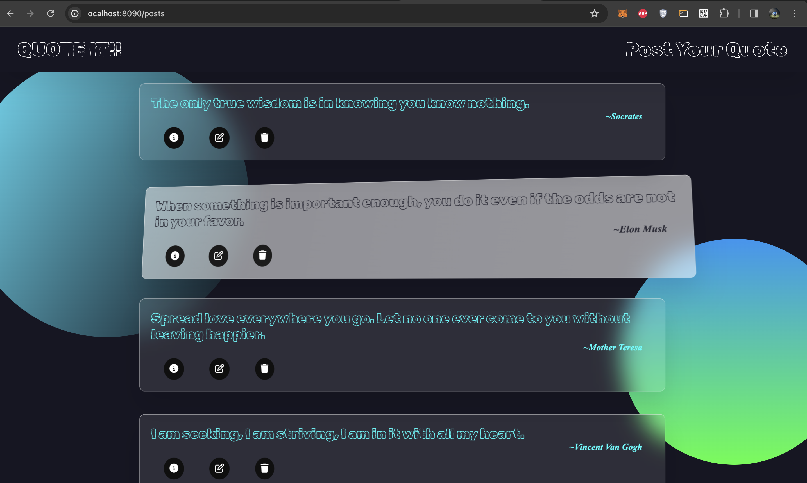
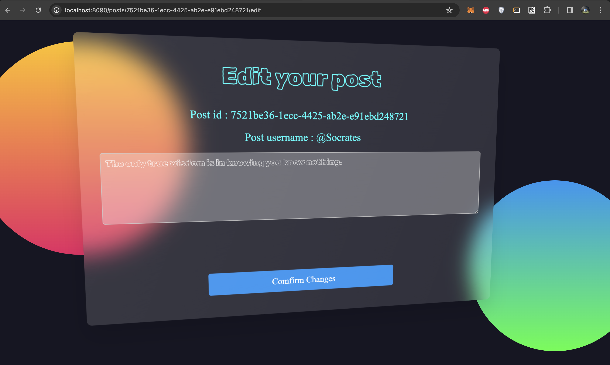
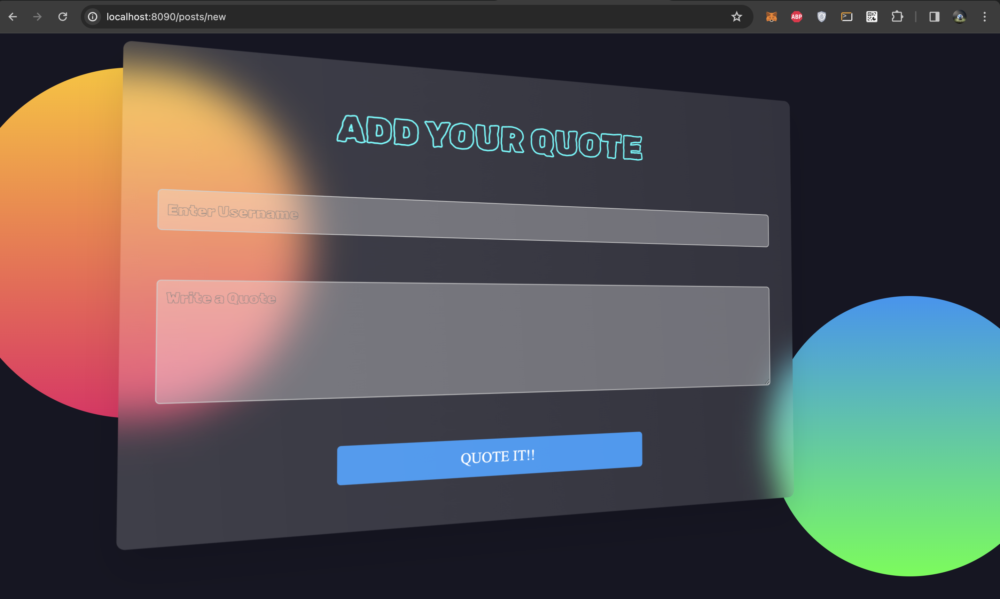
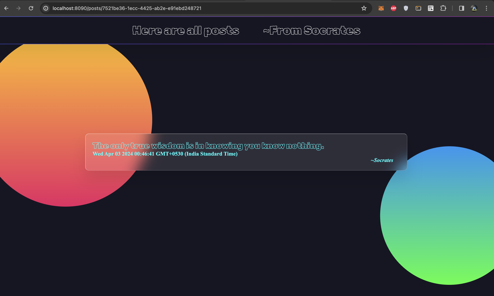

# Project Name: Quote It!

## Description:
Quote It! is a simple web application where users can read, create, edit, and delete quotes. It allows users to share inspirational and thought-provoking quotes with others. The application is built using Node.js with the Express.js framework for the backend and EJS for the frontend. It utilizes UUID for generating unique identifiers for each quote and Faker.js for generating fake timestamps. The application follows RESTful routing principles for handling CRUD operations.

## Features:
1. **View All Quotes**: Users can view all the quotes available on the platform.
2. **Create New Quote**: Users can create a new quote by providing their username and the quote content.
3. **View Individual Quote**: Users can view an individual quote along with its details such as username, content, and timestamp.
4. **Edit Quote**: Users can edit an existing quote to update its content.
5. **Delete Quote**: Users can delete a quote if they no longer want it to be available on the platform.

## Technologies Used:
- **Node.js**: Backend JavaScript runtime environment.
- **Express.js**: Web application framework for Node.js used for building the RESTful API.
- **EJS**: Embedded JavaScript templating engine for rendering dynamic HTML pages.
- **UUID**: Library for generating unique identifiers.
- **Faker.js**: Library for generating fake data, used for creating fake timestamps.
- **HTML/CSS**: For structuring and styling the frontend views.
- **Vanilla Tilt**: JavaScript library for adding a tilt effect to elements.
- **Font Awesome**: Library for adding icons to the web pages.

## Getting Started:
1.Clone the repository:
   ```bash
   git clone https://github.com/ekas59425/Quote-it.git
   ```
2.Run on local host
   ```bash
   node index.js
   ```
3.Open your web browser and visit  [http://localhost:8090/](http://localhost:8090/) and Start posting
## Screenshots
### Home

### Edit Your Post

### Adding New Post

### Detailed Post with Post time



## Usage

Follow these steps to use the Quote It! application:

1. Visit the homepage to view all the available quotes.
2. Click on "Post Your Quote" to create a new quote.
3. Click on a quote to view its details, edit, or delete it.

## References

- [Node.js](https://nodejs.org/)
- [Express.js](https://expressjs.com/)
- [EJS](https://ejs.co/)
- [UUID](https://www.npmjs.com/package/uuid)
- [Faker.js](https://www.npmjs.com/package/faker)
- [Vanilla Tilt](https://micku7zu.github.io/vanilla-tilt.js/)
- [Font Awesome](https://fontawesome.com/)

## Contributing

Feel free to contribute to the development of Quote It! by creating issues or submitting pull requests.
